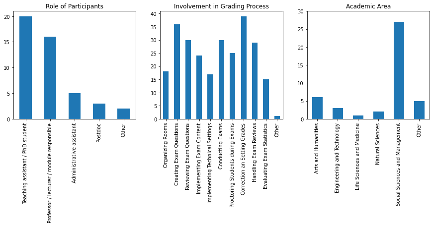
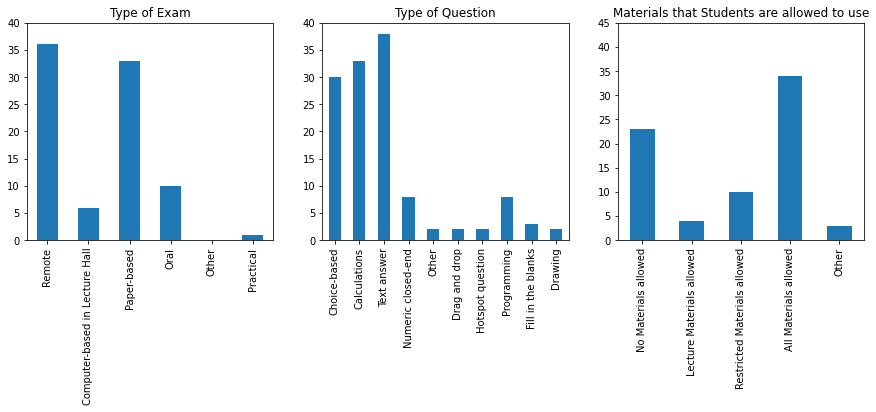
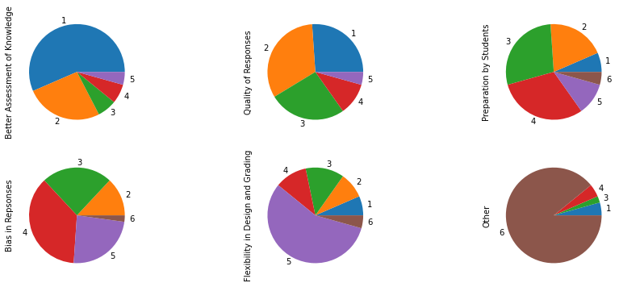
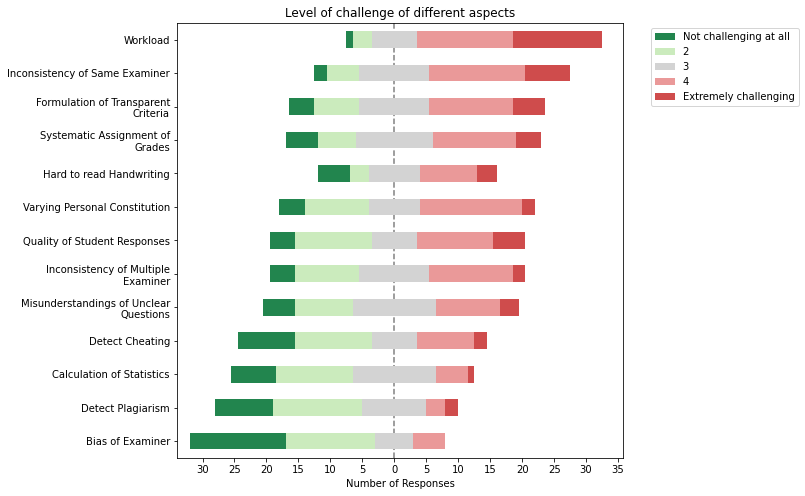
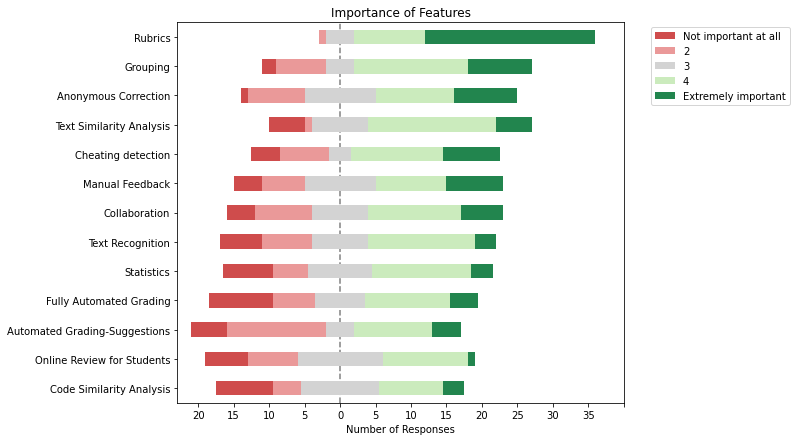

# Summary of Survey "P8: Correction of open-ended exam questions through automatization"

#survey #summary

This document summarizes the results of the online-survey on the correction of open-ended exam questions through automatization.

### Who participated?

45 people completed our survey and provided valuable feedback. The following graphs summarize the roles of the participants, their involvement in the grading process, and the academic area in which they conduct their exams.

### How do the participants conduct their exams?

Exams at our university differ in several aspects. The different aspects are indicated on the graphs below: exams vary in setting (e.g., paper-based in the lecture hall), types of questions asked (e.g., multiple choice), and the student's material permitted (e.g., open-book).

### What motivates examiners to include open-ended questions?

There are several reasons an examiner may include open-ended questions in an exam. One question in our survey investigated their main qualities.

_In your opinion, what are the most beneficial factors of open-ended questions? Please rank the factors by assigning their relative rank compared to the other options._

According to the participants of our survey, the key advantage of open-ended questions is the ability to better assess the students' knowledge (e.g., covering more levels of Bloom's taxonomy; average ranking 1.76), followed by the improved quality of the students' answers (e.g. harder to guess, more detailed; average ranking 2.34). The remaining aspects are, on average, perceived to be considerably less beneficial. The mean and standard deviation of the ranking of each beneficial aspects can be found in the appendix.

### What challenges arise from open-ended questions?

While open-ended questions provide numerous advantages, they also present challenges to examiners. One question focused on how challenging different aspects of grading open-ended questions are.

_In your opinion, how challenging are these factors regarding the correction of open-ended exam questions? Please classify each of the following factors according to their level of challenge._

The participants perceived the considerable workload of grading open-ended questions as the biggest challenge (average rating 3.95/5), followed by the inconsistency of examiners (e.g. allocation of a different number of points for the "same" answer; average rating 3.50) and the definition of transparent grading criteria (3.20). Further aspects deemed relatively challenging were the systematic assignment of grades (3.13), potentially hard-to-read handwriting (3.07), varying personal constitution (3.05), the quality of the students' responses (3.05), the inconsistency of multiple examiners grading the same exam (2.96), and the misunderstanding of unclear questions (2.93). The remaining aspects of open-ended questions included in our survey were, on average, perceived to be less challenging. The mean and standard deviation of the rating of each challenge can be found in the appendix.

### How widespread is the use of software for grading open-ended questions among the participants?

One question in our survey focused on whether our participants already used software to grade open-ended questions.

_Have you previously used software with the specific goal of improving the grading process of open-ended questions? If yes, what software have you used? If no, do you think software could help you with the grading process? How?_

Of the 27 participants who have explicitly stated whether they have used software for grading open-ended questions, 10 answered yes (i.e. 37%). Software listed by the participants includes Ans, SEB, EPIS, as well as a tool developed by the Teaching Center to grade Excel exams, and, in one case, even a participant's self-created tool. Of the people who have never used software, five explicitly stated that they think software would be useful (e.g. "Software might help in making a scheme of points to be reviewed when choosing the grade for an open question") and ten explicitly stated that they do not think there exists useful software that facilitates the grading of open-ended questions (e.g. “I would be surprised if there were a software that did a reasonably good job at this”).

### What features do the participant think would be useful?

The use of software could, at least partially, address some of the challenges arising from open-ended questions. One question in our survey focused on which features of a software would be helpful for the grading process.

_Please classify each of the following concepts according to their importance when focusing on the correction of open-ended exam questions._

The feature clearly considered to be the most important is the possibility to specify consistent correction criteria, a concept known as rubrics (average rating 4.46). Additional relevant features include the ability to automatically group similar answers (3.60), implement anonymous correction (3.48), use text similarity analysis (3.46) and cheating detection (3.40), as well as the option of writing manual feedback (3.31). The other features we included in our survey were, on average, perceived to be less important. The mean and standard deviation of the rating of each feature can be found in the appendix.

### Additional Remarks of Participants

Our participants shared a lot of very helpful remarks with us, rangingfrom suggestions for additional resources (e.g., "I think it would be interesting to have a general document describing how are failing grades/grading curves used") to affirmation of the importance of open-ended questions (e.g., "Having been a student here myself, I think multiple choice questions provide bad incentives for learning; it would be much better if they were replaced with open-ended questions, for which automated tools could be very valuable"). Moreover, skepticism towards automated solution was widespread in the remarks (e.g., "I think that open ended exam questions shouldn't be automated", "Apart from multiple choice, having computers try to grade exams is a waste of time and resources").

### Appendix

1. Table with mean and standard deviation of the ranking of different motivations for including open-ended questions in exams:

|                                   | Description in Survey                                                                                                                  | Mean | StdDev |
| --------------------------------- | -------------------------------------------------------------------------------------------------------------------------------------- | ---- | ------ |
| Better Assessment of Knowledge    | Better assessment of knowledge (e.g., higher cognitive thinking levels, assessing recall, broader knowledge)                           | 1.76 | 1.12   |
| Quality of Responses              | Improved quality of responses (e.g., harder to guess, more detailed responses, broader range of possible answers)                      | 2.35 | 1.12   |
| Preparation by Students           | More thorough preparation by students (e.g., because students study more for open-ended questions)                                     | 3.33 | 1.23   |
| Bias in Responses                 | Less bias in responses (e.g., because response options are not specified)                                                              | 3.78 | 1.03   |
| Flexibility in Design and Grading | Flexibility in grading and design (e.g., no formatting requirements, accounting for consequential errors, fits lecture content better) | 4.15 | 1.35   |
| Other                             | Other (please specify)                                                                                                                 | 5.63 | 1.16   |

2. Table with mean and standard deviation of ratings of all included challenges arising from open-ended questions:

|                                        | Description in Survey                                                                                                           | Mean | StdDev |
| -------------------------------------- | ------------------------------------------------------------------------------------------------------------------------------- | ---- | ------ |
| Workload                               | The overall workload of the correction process                                                                                  | 3.95 | 1.04   |
| Inconsistency of Same Examiner         | Individual correction differences (e.g., allocating a different number of points for same answers)                              | 3.50 | 1.09   |
| Formulation of transparent Criteria    | Formulating transparent solution criteria to provide feedback to the students (e.g., during exam review)                        | 3.20 | 1.18   |
| Systematic Assignment of Grades        | Assigning grades systematically (e.g., defining a fair grading scheme)                                                          | 3.13 | 1.18   |
| Hard to read Handwriting               | Hard to read handwriting                                                                                                        | 3.07 | 1.27   |
| Varying Personal Constitution          | Varying personal constitution throughout the exam correction (e.g., attention span, motivation)                                 | 3.05 | 1.13   |
| Quality of Student Responses           | Quality of student responses (e.g., students guessing or listing a lot of unrelated information hoping to get points by chance) | 3.05 | 1.24   |
| Inconsistency of Multiple Examiner     | Differing expectations between examiners (when there is more than one person correcting the exam)                               | 2.98 | 1.10   |
| Misunderstandings of Unclear Questions | Handling misunderstandings when questions are not formulated clearly (e.g., awarding points for unclear questions)              | 2.93 | 1.14   |
| Detect Cheating                        | Cheating detection (e.g., detecting similar answers)                                                                            | 2.56 | 1.23   |
| Calculation of Statistics for Analysis | Calculation of assignment and question statistics for later analysis (e.g., hard questions, item analysis)                      | 2.50 | 1.03   |
| Detect Plagiarism                      | Detecting plagiarism (e.g., missing references)                                                                                 | 2.34 | 1.09   |
| Bias of Examiner                       | Impartiality and inadvertent biases of the examiner (e.g., discrimination because of name)                                      | 2.03 | 1.03   |

3. Table with mean and standard deviation of ratings of all included features:

|                                                                                                 | Description in Survey                                                                                                                                    | Mean | StdDev |
| ----------------------------------------------------------------------------------------------- | -------------------------------------------------------------------------------------------------------------------------------------------------------- | ---- | ------ |
| [Rubrics](research/features/definitions/rubrics.md)                                             | Consistent correction criteria across students (e.g., by establishing correction criteria and grading by selecting applicable criteria for each student) | 4.46 | 0.79   |
| [Grouping](research/features/definitions/grouping.md)                                           | Grouping of similar responses to improve efficiency (e.g., to grade all responses with the same content consistently and in fewer clicks)                | 3.60 | 1.20   |
| [Anonymity](research/features/definitions/anonymity.md)                                         | Anonymous correction so that graders cannot identify students                                                                                            | 3.49 | 1.14   |
| [Text Similarity Analysis](research/features/definitions/text-similarity-analysis.md)           | Text similarity analysis between students (e.g., for essay questions)                                                                                    | 3.46 | 1.19   |
| [Cheating Detection](research/features/definitions/cheating-detection.md)                       | Cheating detection (e.g., based on statistical approaches or response content)                                                                           | 3.40 | 1.35   |
| [Manual Feedback](research/features/definitions/manual-feedback.md)                             | Giving manual feedback to students (e.g., making comments on mistakes when grading)                                                                      | 3.32 | 1.28   |
| [Collaboration](research/features/definitions/collaboration.md)                                 | Possibility to distribute grading workload over different people (collaborative / delegated grading)                                                     | 3.23 | 1.25   |
| [Text Recognition](research/features/definitions/text-recognition.md)                           | Conversion of handwriting to text for easier processing                                                                                                  | 3.05 | 1.23   |
| [Statistics](research/features/definitions/statistics.md)                                       | Assignment and question statistics (e.g., automated computation of question difficulty, item analysis)                                                   | 3.02 | 1.26   |
| [Fully Automated Grading](research/features/definitions/fully-automated-grading.md)             | Fully automated points calculation (e.g., based on rules, solution space, or other automated approaches)                                                 | 2.90 | 1.37   |
| [Automated Grading Suggestions](research/features/definitions/automated-grading-suggestions.md) | Automated suggestion of correction criteria and points for each student (i.e., with manual approval)                                                     | 2.87 | 1.27   |
| [Exam Review](research/features/definitions/exam-review.md)                                     | Possibility for online-exam review for the students (e.g., with a login to the platform)                                                                 | 2.87 | 1.20   |
| [Code Similarity Analysis](research/features/definitions/code-similarity-analysis.md)           | Code similarity analysis for programming questions                                                                                                       | 2.86 | 1.29   |
